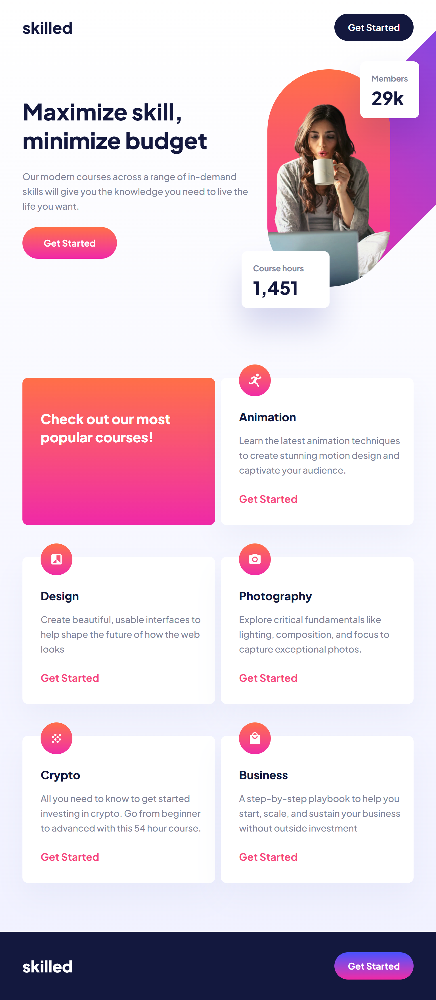

# Frontend Mentor - Skilled e-learning landing page solution

This is a solution to the [Skilled e-learning landing page challenge on Frontend Mentor](https://www.frontendmentor.io/challenges/skilled-elearning-landing-page-S1ObDrZ8q). Frontend Mentor challenges help you improve your coding skills by building realistic projects.

## Table of contents

- [Frontend Mentor - Skilled e-learning landing page solution](#frontend-mentor---skilled-e-learning-landing-page-solution)
  - [Table of contents](#table-of-contents)
  - [Overview](#overview)
    - [Screenshot](#screenshot)
    - [Links](#links)

## Overview

### Screenshot

|Desktop|Tablet|Mobile|
|--|--|--|
||||

### Links

- Solution URL: [Frontend Mentor solution page](https://your-solution-url.com)
- Live Site URL: [Github Page](https://kosmonavtsv.github.io/skilled-elearning-landing-page)